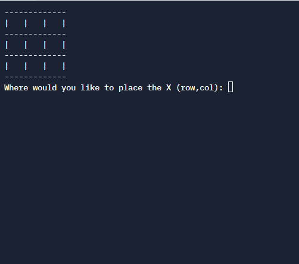

# TicTacToe project

For this project, you will build a TicTacToe game all in javascript NodeJs.

## Getting Started

To get started, it is recommended to create a new Replit with Nodejs as the template.
Copy the code from main.js into the replit.

The code given is meant to be a guildine as well as providing a couple of helper methods.
Feel free to change them as you see fit.

Topics to cover:

- Use of 2d Arrays

- Modular Code (splitting the code into many functions)

- Loops, for loops, and nested for loops

- User input

- Error handling

## Requirements

- Program must do what is stated in the code comments (play TicTacToe)

- Program must not break for any reason.

- If user input is invalid, program must not break or exit (should prompt the user again for input)

- Bonus: create the option to play against Computer (computer moves can just be random legal moves)

- Bonus: Add tests for functions created

